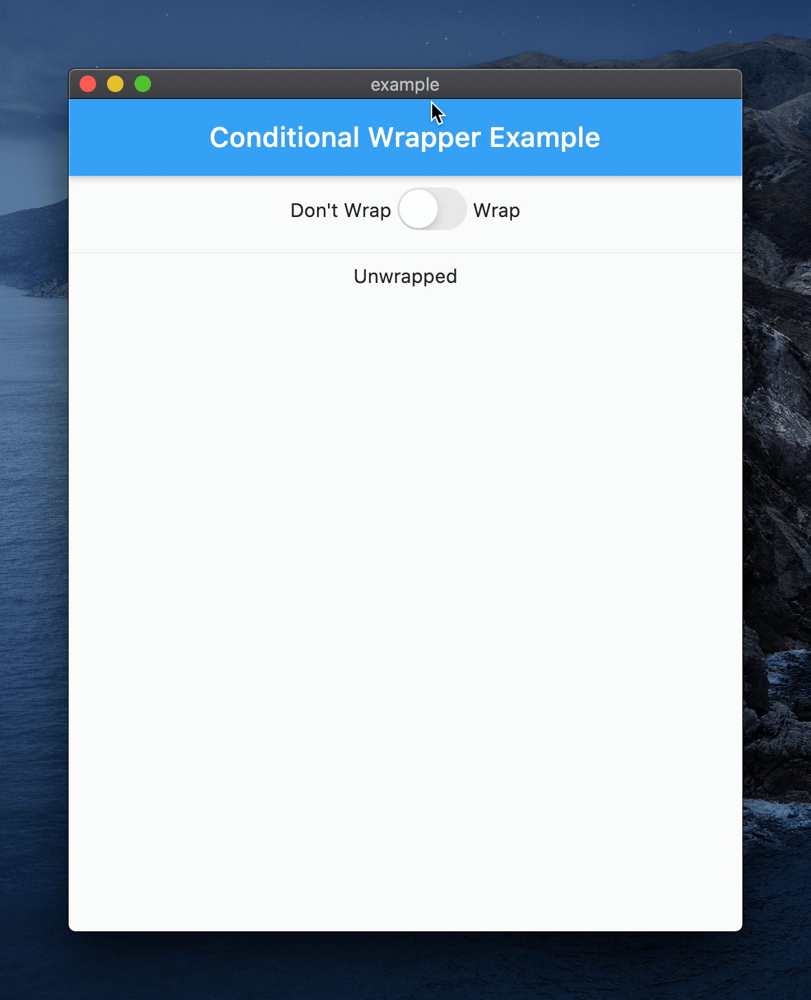

# Conditional Wrapper

[](https://pub.dartlang.org/packages/conditional_wrapper)

A widget that allows you to conditionally wrap a child subtree with a parent widget



## Usage

Simply wrap the widget subtree with a `ConditionalWrapper` widget and pass the required properties.

```dart
ConditionalWrapper(
  condition: shouldIncludeParent,
  builder: (context, child) => ParentWidget(child: child),
  child: ChildSubtree(),
),
```

You can also provide an alternative builder to use when the `condition` is false.

```dart
ConditionalWrapper(
  condition: shouldUseTheDefaultBuilder,
  builder: (context, child) => ParentWidget(child: child),
  ifFalse: (context, child) => AlternativeParent(child: child),
  child: ChildSubtree(),
),
```